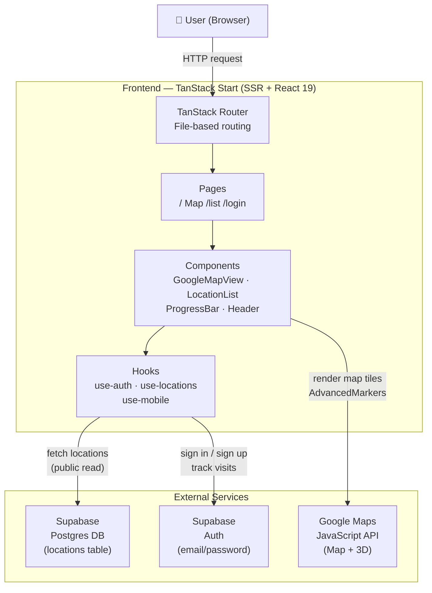
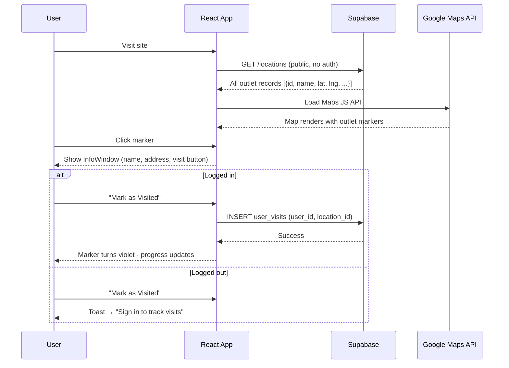
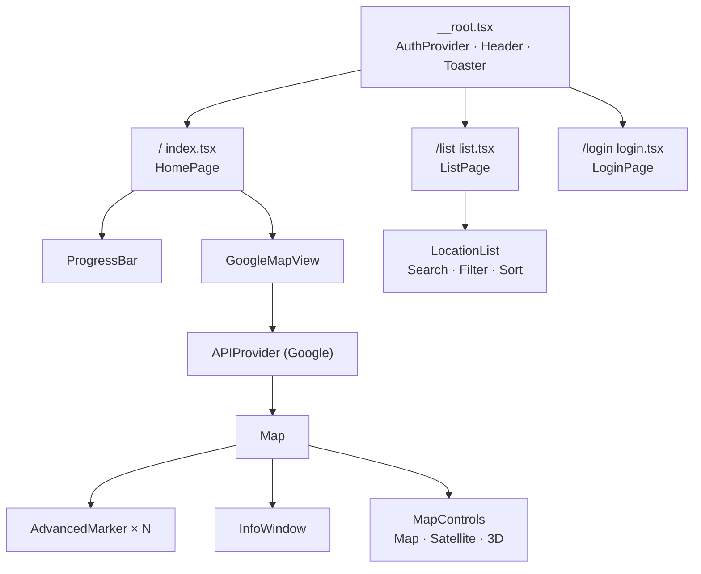
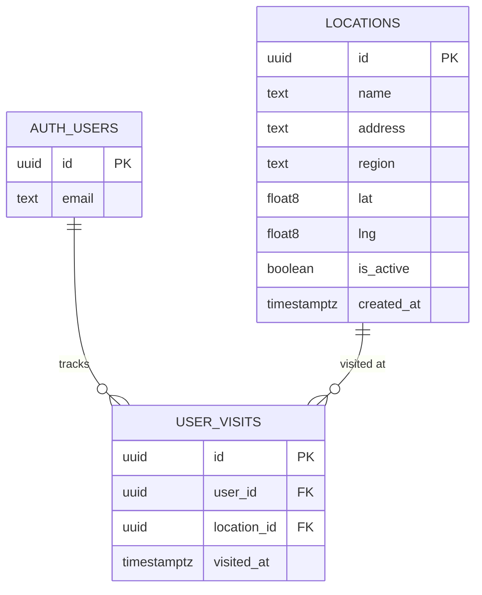

# AF Tracker SG

> Track every Anytime Fitness outlet you've visited across Singapore — on an interactive Google Map with 3D view, a searchable list, and personal progress stats.

---

## Table of Contents

- [Overview](#overview)
- [Architecture](#architecture)
- [User Guide](#user-guide)
- [Developer Guide](#developer-guide)
- [Environment Variables](#environment-variables)
- [Tech Stack](#tech-stack)

---

## Overview

AF Tracker SG is a personal fitness journey tracker for Anytime Fitness members in Singapore. It lets you:

- Browse **all AF outlets** across Singapore on an interactive Google Map
- Switch between **Map**, **Satellite**, and **3D** views
- **Mark outlets as visited** with a single tap (requires free account)
- See your **progress** — how many of the total outlets you've hit
- **Search and filter** the full outlet list by name, region, or visit status

The app is fully responsive across mobile, tablet, and desktop.

---

## Architecture

### System Overview



### Data Flow



### Component Tree



### Database Schema



---

## User Guide

### Getting started

1. **Open the app** — you'll see the Singapore map with pins for every AF outlet.
2. **Explore the map** — click any pin to see the outlet name, address, and region.
3. **Switch views** — use the buttons at the bottom of the map:
   - **Map** — clean dark road map
   - **Satellite** — real satellite imagery
   - **3D** — satellite with 60° tilt for a perspective city view
4. **Re-center** — tap the crosshair icon to fit all outlets in view.

### Tracking your visits

1. **Sign up** — tap **Sign in** in the top-right corner and create a free account.
2. **Mark a visit** — click any outlet pin → tap **Mark as Visited** in the popup.
3. **Unmark** — click the same pin again → tap **Unmark Visit**.
4. **Watch your progress** — the progress bar at the top shows how many outlets you've hit.

### The List view

Switch to **List** in the navigation bar to:

- **Search** outlets by name or address
- **Filter** by All / Visited / Unvisited
- **Sort** by name, region, or visit date
- See a count of matching results

---

## Developer Guide

### Prerequisites

| Tool | Version |
|------|---------|
| Node.js | ≥ 20 |
| npm | ≥ 10 |
| Supabase account | — |
| Google Cloud account | — |

### Quick start

```bash
# 1. Clone the repo
git clone https://github.com/bernardinolintang/af-journey-map.git
cd af-journey-map

# 2. Install dependencies
npm install

# 3. Copy and fill in environment variables
cp .env.example .env
# edit .env — see Environment Variables section below

# 4. Start the dev server
npm run dev
```

The app runs at `http://localhost:3000`.

### Available scripts

| Script | Description |
|--------|-------------|
| `npm run dev` | Start dev server with HMR |
| `npm run build` | Production build |
| `npm run preview` | Preview production build locally |
| `npm run lint` | Run ESLint |
| `npm run format` | Format with Prettier |

### Project structure

```
af-journey-map/
├── src/
│   ├── components/
│   │   ├── GoogleMapView.tsx   # Interactive map with 3D toggle
│   │   ├── Header.tsx          # Navigation bar
│   │   ├── LocationList.tsx    # Searchable outlet list
│   │   ├── ProgressBar.tsx     # Visit progress stats
│   │   └── ui/                 # shadcn/ui primitives
│   ├── hooks/
│   │   ├── use-auth.tsx        # Supabase auth state
│   │   ├── use-locations.tsx   # Outlet data + visit toggling
│   │   └── use-mobile.tsx      # Responsive breakpoint
│   ├── integrations/
│   │   └── supabase/           # Supabase client + types
│   ├── routes/
│   │   ├── __root.tsx          # Root layout
│   │   ├── index.tsx           # Home (map)
│   │   ├── list.tsx            # Outlet list
│   │   └── login.tsx           # Auth page
│   └── styles.css              # Global styles + design tokens
├── supabase/
│   └── migrations/             # DB migration SQL files
├── .env                        # Local environment (git-ignored)
├── vite.config.ts
└── README.md
```

### Supabase setup

1. Create a project at [supabase.com](https://supabase.com)
2. Run the migrations in `supabase/migrations/` in order via the SQL editor
3. The `locations` table is **publicly readable** (no auth required)
4. The `user_visits` table requires auth for writes; Row Level Security is enabled

### Google Maps setup

1. Go to [Google Cloud Console](https://console.cloud.google.com)
2. Enable the **Maps JavaScript API**
3. Create an **API Key** under Credentials
4. *(Optional)* Create a **Map ID** (Map Management → Web → Vector) for full 3D road-view tilt support
5. Add both to your `.env`

### Deployment

The app is configured for **Cloudflare Pages** via `wrangler.jsonc`. To deploy:

```bash
npm run build
npx wrangler pages deploy .output/public
```

Set all environment variables in the Cloudflare Pages dashboard (same keys as `.env`).

---

## Environment Variables

Create a `.env` file in the project root with the following keys:

```env
# Google Maps (required for interactive map)
VITE_GOOGLE_MAPS_API_KEY="your_google_maps_api_key"

# Google Maps Map ID (optional — enables 3D on road view)
VITE_GOOGLE_MAPS_MAP_ID="your_map_id"

# Supabase (required for auth + data)
VITE_SUPABASE_URL="https://your-project.supabase.co"
VITE_SUPABASE_PUBLISHABLE_KEY="your_supabase_anon_key"
```

> **Never commit `.env` to source control.** It is listed in `.gitignore`.

---

## Tech Stack

| Layer | Technology |
|-------|-----------|
| Framework | [TanStack Start](https://tanstack.com/start) (SSR + React 19) |
| Routing | [TanStack Router](https://tanstack.com/router) (file-based) |
| Styling | [Tailwind CSS v4](https://tailwindcss.com) + [shadcn/ui](https://ui.shadcn.com) |
| Map | [Google Maps JS API](https://developers.google.com/maps/documentation/javascript) via [@vis.gl/react-google-maps](https://visgl.github.io/react-google-maps/) |
| Auth + DB | [Supabase](https://supabase.com) (Postgres + Auth) |
| Fonts | [Sora](https://fonts.google.com/specimen/Sora) + [DM Sans](https://fonts.google.com/specimen/DM+Sans) |
| Deployment | [Cloudflare Pages](https://pages.cloudflare.com) |
| Build tool | [Vite 7](https://vitejs.dev) |
